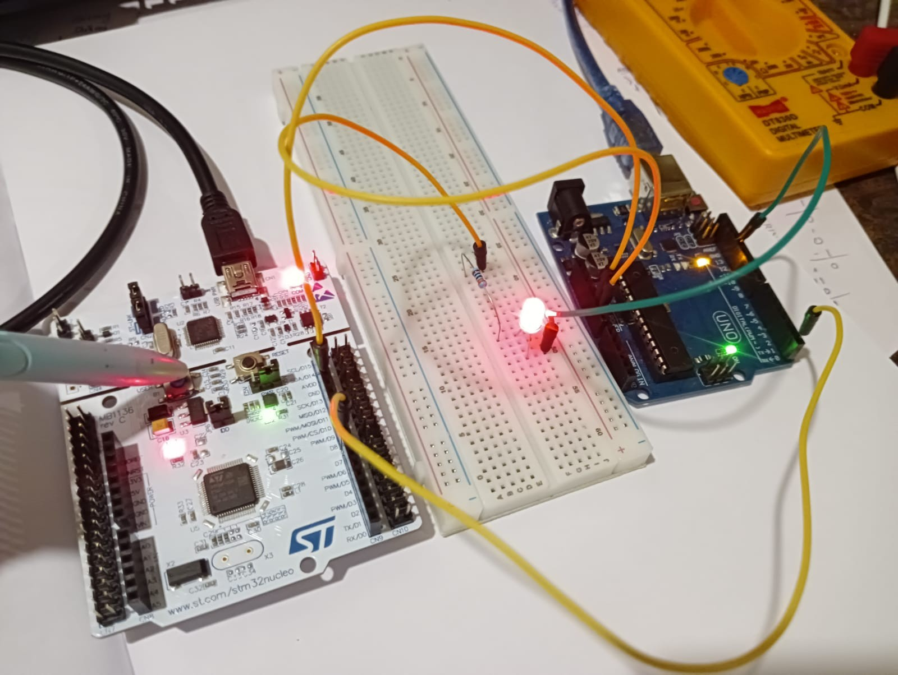

### STM32 to Arduino UART Communication Project

This project demonstrates one-way UART communication between an **STM32 NUCLEO-F401RE** board and an **Arduino Uno**. When the blue user button (B1) on the STM32 is pressed, it toggles the onboard green LED and streams a raw binary byte state over USART1 directly to the Arduino Uno. 

### Picture


### 🔌 Hardware Wiring Diagram (2-Wire Setup)

Because the STM32's PA9 pin is **5V-Tolerant (FT)**, we can connect the transmission line safely without an external logic level converter or resistor. We omit the Arduino TX line entirely to ensure no 5V signals flow back into the STM32. 


# STM32 → Arduino Uno UART Connection

```text
STM32 Board (3.3V)                              Arduino Uno (5V)
+-----------------------+                       +-----------------------+
|                       |                       |                       |
|   PA9 (Pin D8 / TX)   |---------------------->|   Pin 0 (D0 / RX)     |
|                       |                       |                       |
|         GND           |---------------------->|          GND          |
+-----------------------+                       +-----------------------+

```

### Connection Summary:

1. Connect **STM32 PA9 (D8)** directly to **Arduino Pin D0**.
2. Connect **STM32 GND** directly to **Arduino GND**.

### 💻 Code Explanations

### 1. STM32 Nucleo Code (STM32_Code/main.c)

* **Peripheral:** USART1 initialized at **9600 Baud**, 8-bit word length, 1 stop bit, no parity.
* **Pins Used:** PA9 configured as USART1_TX.
* **Method:** Uses register-level monitoring to check the blue button (PC13). When low (pressed), it transmits a single raw byte (1) using HAL_UART_Transmit. When released, it transmits 0. Code logic is written strictly inside CubeIDE user protection blocks.

### 2. Arduino Uno Code (Arduino_Code/Arduino_Code.ino)

* **Interface:** Uses the native **Hardware Serial** interface (Serial) on digital pins 0 (RX) and 1 (TX). This allows the board to read direct incoming UART data from the STM32 while keeping the laptop USB link active for power.
* **Method:** Constantly samples the incoming serial data stream queue using Serial.available(). It reads incoming byte packets, compares them against conditional states ('1' and '0'), and directly triggers digital pin 13 to control the LED.